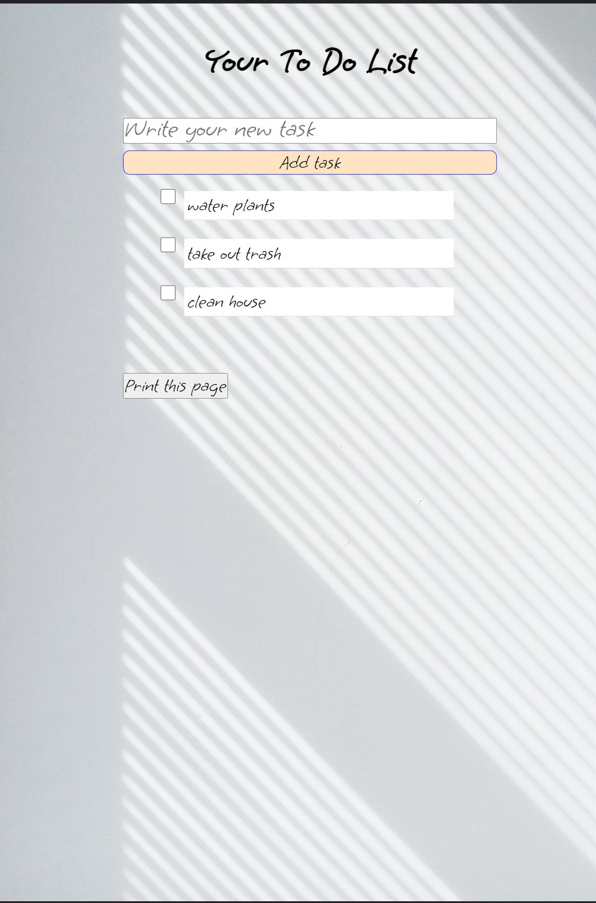
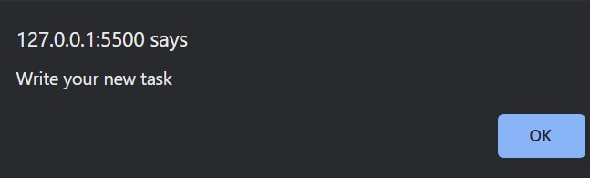
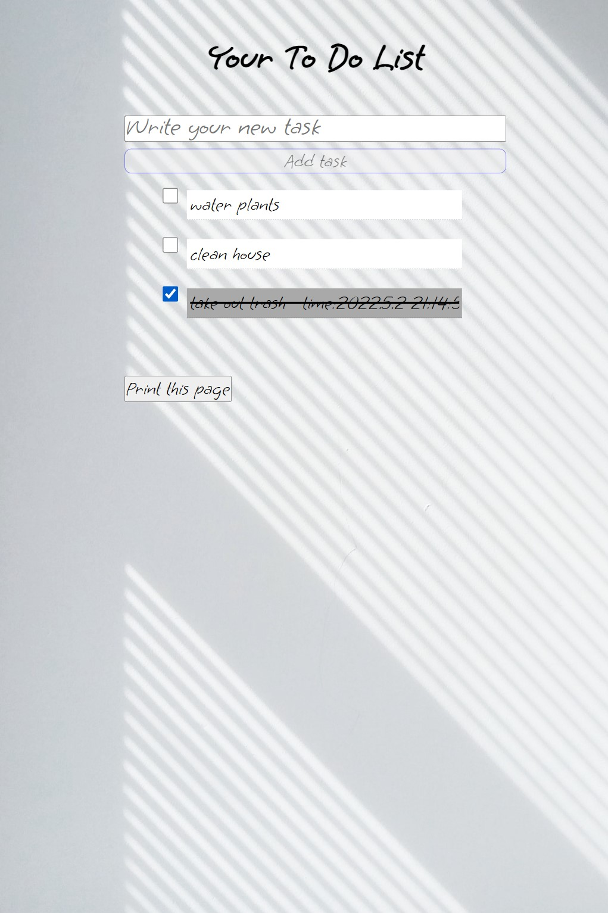

# ToDoList

ToDoList in JavaScript, CSS, HTML.

What you can:

- write new tasks (if you don't type new task, you get error note),
  

- check done tasks (tasks go to the end of the list and have date)

- print list

You can make a list on different mobile devices.
I used responsive viewport units.
